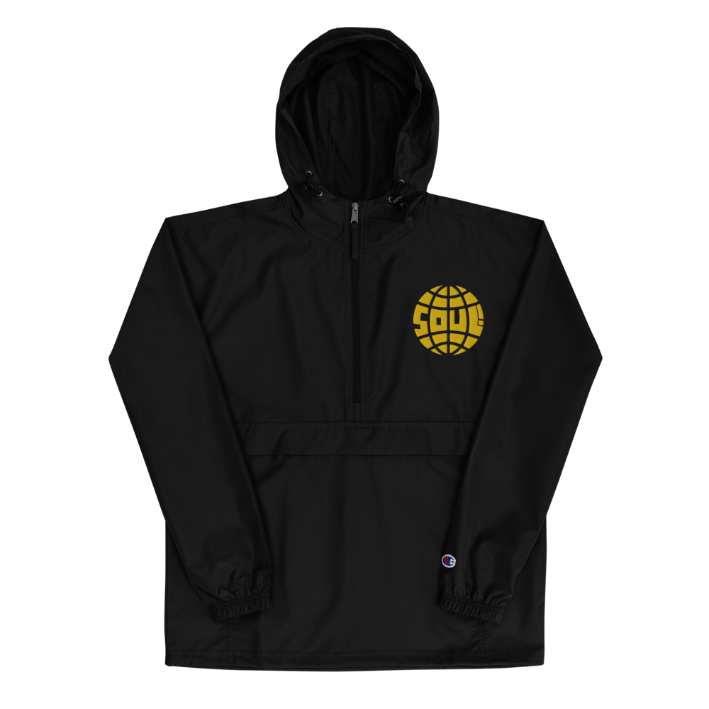
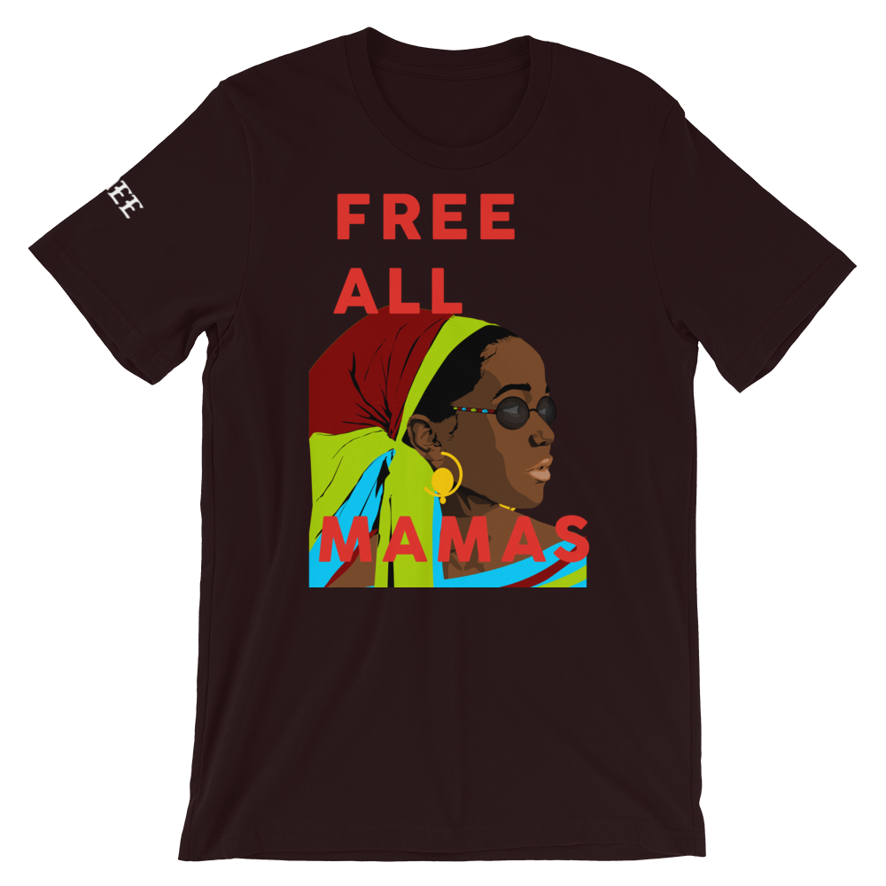

IMEWE is a agency I created to satisfy the requests that I get to build
different projects. Whether its branding for new businesses, a random logo,
a custom website, or a whole app: IMEWE uses our 3 step process to get it done.

---

**Dream**: First we gotta sit with the Idea and get it to its best form. That's the Dream. The highest form of the Idea.

**Design**: Then you gotta get with the arts and crafts and create the elements of Dream so that it becomes tangible.
Whether its a logo, a brand, apparel, the website pages, or the app screens.

**Deliver**: Finally, the real work, we start to write the code, make the apparel and finalize designs. And then we deliver.

---

The name IMEWE comes from an Igbo word meaning to design or to manufacture.

Source Code inspired by and taken from the Narative website.

See it [here](https://imewe-xyz.netlify.com) or at the link above.

A few of our sample projects:

<!-- PICTURES OF THE APP UX/  -->
