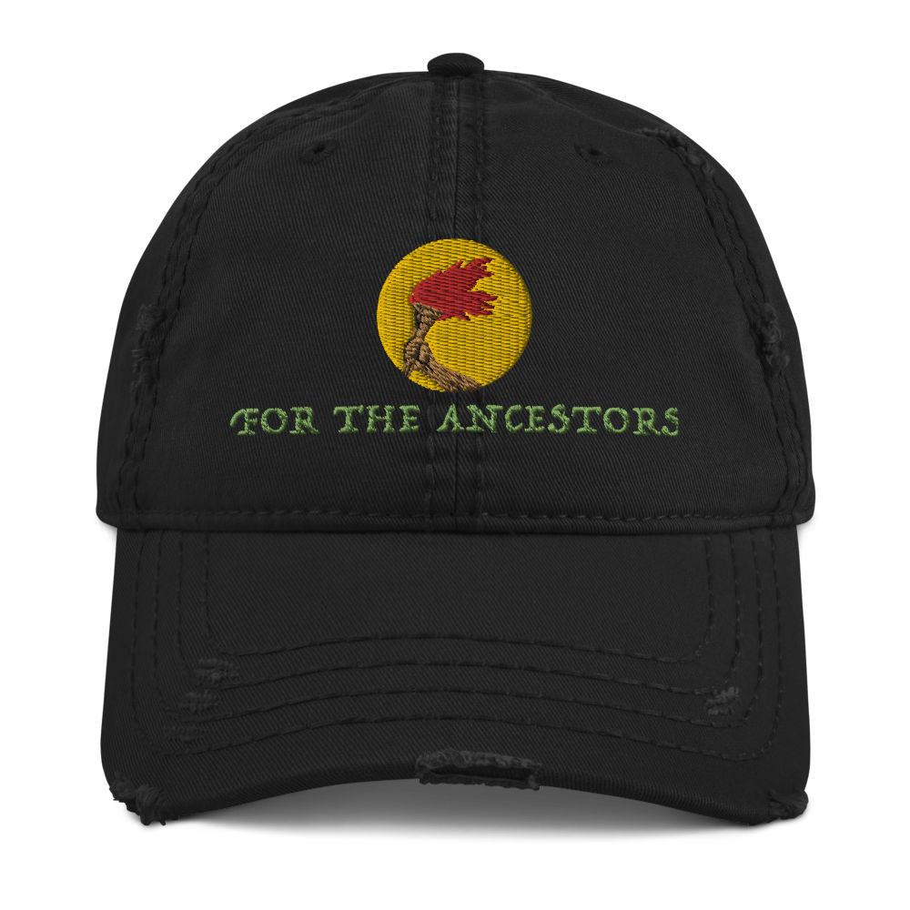
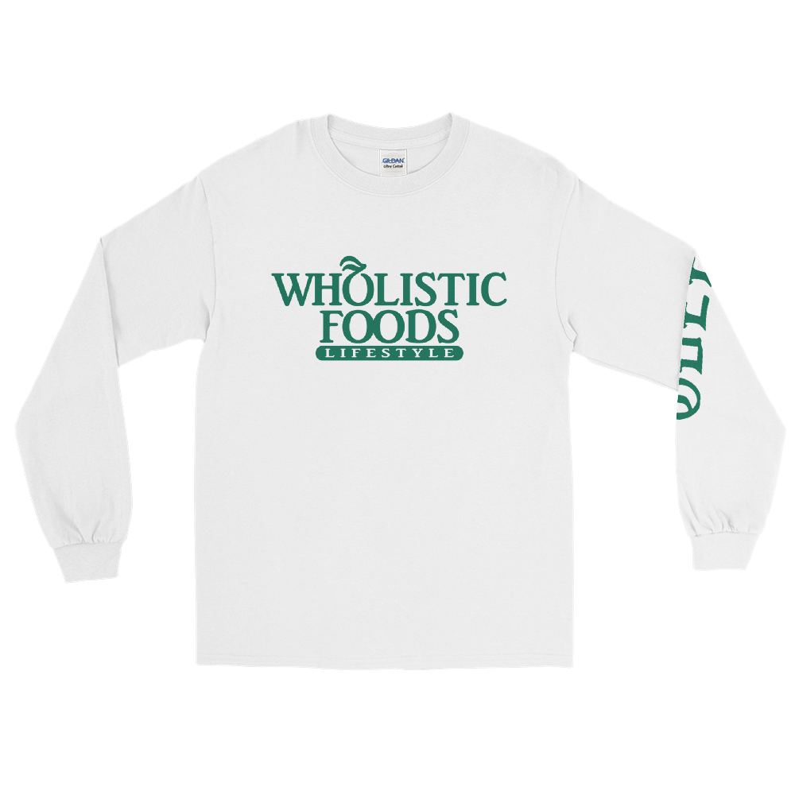
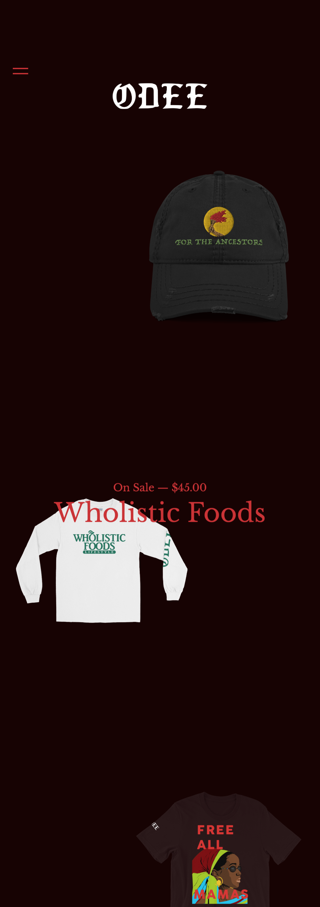

ODEE is my clothing brand that stands for Overcoming Doubt, Excelling Endlessly.

I came up with the idea and design for ODEE after studying the cultural traditions of
my tribe in Africa, the Igbo people. When studying, I found that we practiced a system called Odinani
and I took the Odi part and made ODEE. It also goes along with being OD and going extra hard for what it
is that you want to achieve or bring about.

I wanted to make streetwear with a purpose and a meaning that empowers the wearers and spreads a positive message.

ODEE is still a young brand that is evolving to this day.

Cop some drip ova [here](https://odee.bigcartel.com)

